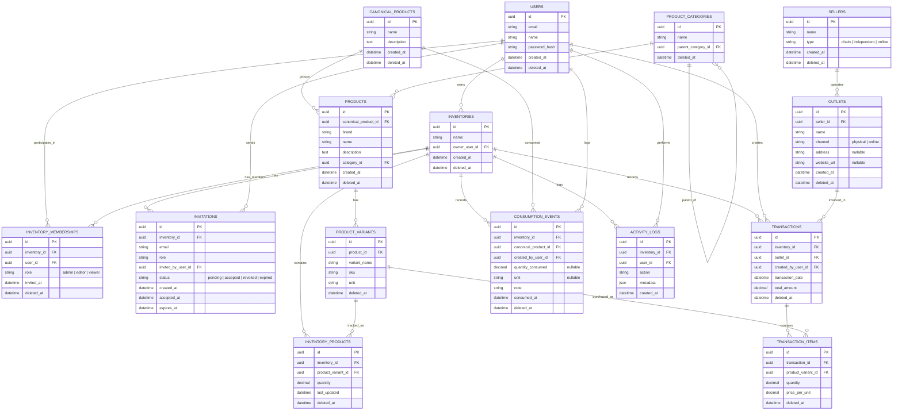

# ukoni api
This is the backend for Ukoni, a household inventory management app.
This API will be built in Golang and will support all the core functionality for the Ukoni app.

## Data model

```mermaid
erDiagram
    USERS {
        uuid id PK
        string email
        string name
        string password_hash
        datetime created_at
        datetime deleted_at
    }

    INVENTORIES {
        uuid id PK
        string name
        uuid owner_user_id FK
        datetime created_at
        datetime deleted_at
    }

    INVENTORY_MEMBERSHIPS {
        uuid id PK
        uuid inventory_id FK
        uuid user_id FK
        string role "admin | editor | viewer"
        datetime invited_at
        datetime deleted_at
    }

    INVITATIONS {
        uuid id PK
        uuid inventory_id FK
        string email
        string role
        uuid invited_by_user_id FK
        string status "pending | accepted | revoked | expired"
        datetime created_at
        datetime accepted_at
        datetime expires_at
    }

    CANONICAL_PRODUCTS {
        uuid id PK
        string name
        text description
        datetime created_at
        datetime deleted_at
    }

    PRODUCTS {
        uuid id PK
        uuid canonical_product_id FK
        string brand
        string name
        text description
        uuid category_id FK
        datetime created_at
        datetime deleted_at
    }

    PRODUCT_VARIANTS {
        uuid id PK
        uuid product_id FK
        string variant_name
        string sku
        string unit
        datetime deleted_at
    }

    PRODUCT_CATEGORIES {
        uuid id PK
        string name
        uuid parent_category_id FK
        datetime deleted_at
    }

    SELLERS {
        uuid id PK
        string name
        string type "chain | independent | online"
        datetime created_at
        datetime deleted_at
    }

    OUTLETS {
        uuid id PK
        uuid seller_id FK
        string name
        string channel "physical | online"
        string address "nullable"
        string website_url "nullable"
        datetime created_at
        datetime deleted_at
    }

    INVENTORY_PRODUCTS {
        uuid id PK
        uuid inventory_id FK
        uuid product_variant_id FK
        decimal quantity
        datetime last_updated
        datetime deleted_at
    }

    TRANSACTIONS {
        uuid id PK
        uuid inventory_id FK
        uuid outlet_id FK
        uuid created_by_user_id FK
        datetime transaction_date
        decimal total_amount
        datetime deleted_at
    }

    TRANSACTION_ITEMS {
        uuid id PK
        uuid transaction_id FK
        uuid product_variant_id FK
        decimal quantity
        decimal price_per_unit
        datetime deleted_at
    }

    CONSUMPTION_EVENTS {
        uuid id PK
        uuid inventory_id FK
        uuid canonical_product_id FK
        uuid created_by_user_id FK
        decimal quantity_consumed "nullable"
        string unit "nullable"
        string note
        datetime consumed_at
        datetime deleted_at
    }

    ACTIVITY_LOGS {
        uuid id PK
        uuid inventory_id FK
        uuid user_id FK
        string action
        json metadata
        datetime created_at
    }

    %% Relationships
    USERS ||--o{ INVENTORY_MEMBERSHIPS : participates_in
    INVENTORIES ||--o{ INVENTORY_MEMBERSHIPS : has_members
    USERS ||--o{ INVENTORIES : owns

    INVENTORIES ||--o{ INVITATIONS : has
    USERS ||--o{ INVITATIONS : sends

    CANONICAL_PRODUCTS ||--o{ PRODUCTS : groups
    PRODUCT_CATEGORIES ||--o{ PRODUCTS : categorises
    PRODUCT_CATEGORIES ||--o{ PRODUCT_CATEGORIES : parent_of

    PRODUCTS ||--o{ PRODUCT_VARIANTS : has

    INVENTORIES ||--o{ INVENTORY_PRODUCTS : contains
    PRODUCT_VARIANTS ||--o{ INVENTORY_PRODUCTS : tracked_as

    INVENTORIES ||--o{ TRANSACTIONS : records
    USERS ||--o{ TRANSACTIONS : creates
    SELLERS ||--o{ OUTLETS : operates
    OUTLETS ||--o{ TRANSACTIONS : involved_in

    TRANSACTIONS ||--o{ TRANSACTION_ITEMS : contains
    PRODUCT_VARIANTS ||--o{ TRANSACTION_ITEMS : purchased_as

    INVENTORIES ||--o{ CONSUMPTION_EVENTS : records
    CANONICAL_PRODUCTS ||--o{ CONSUMPTION_EVENTS : consumed
    USERS ||--o{ CONSUMPTION_EVENTS : logs

    INVENTORIES ||--o{ ACTIVITY_LOGS : logs
    USERS ||--o{ ACTIVITY_LOGS : performs
```
